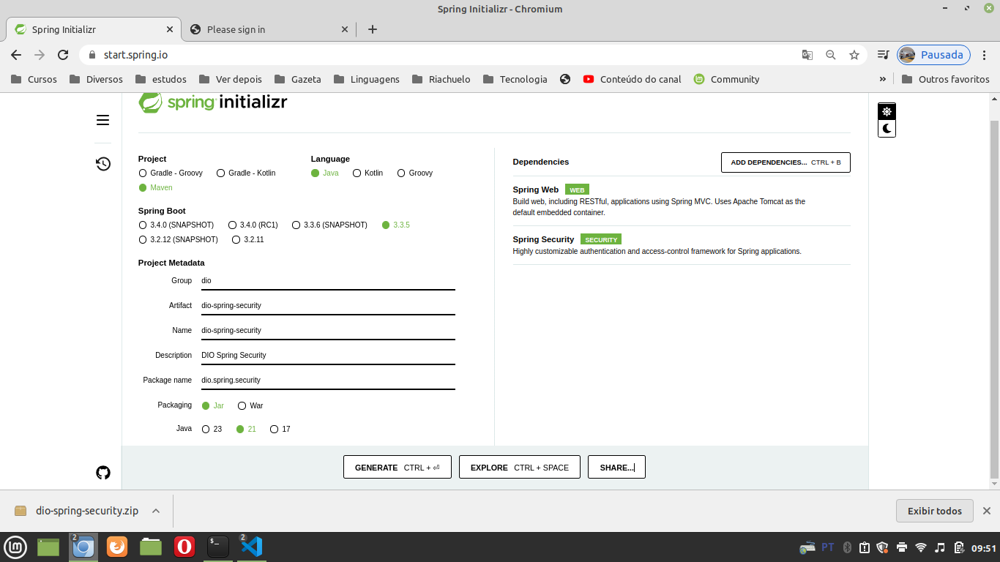
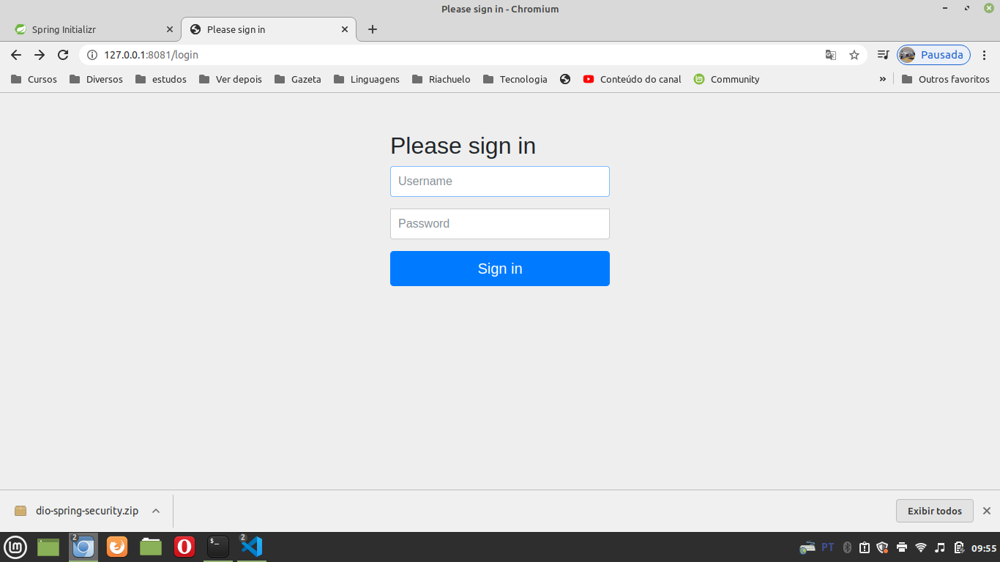
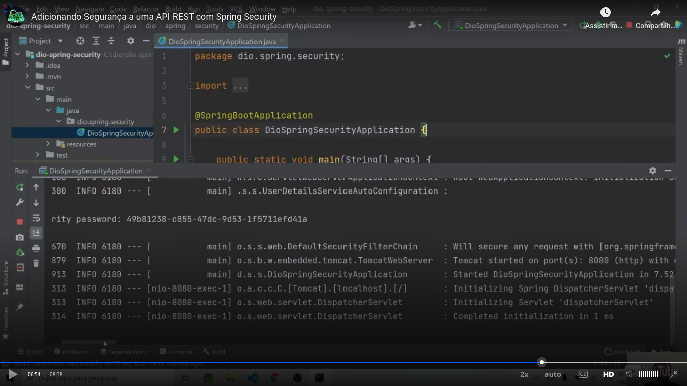
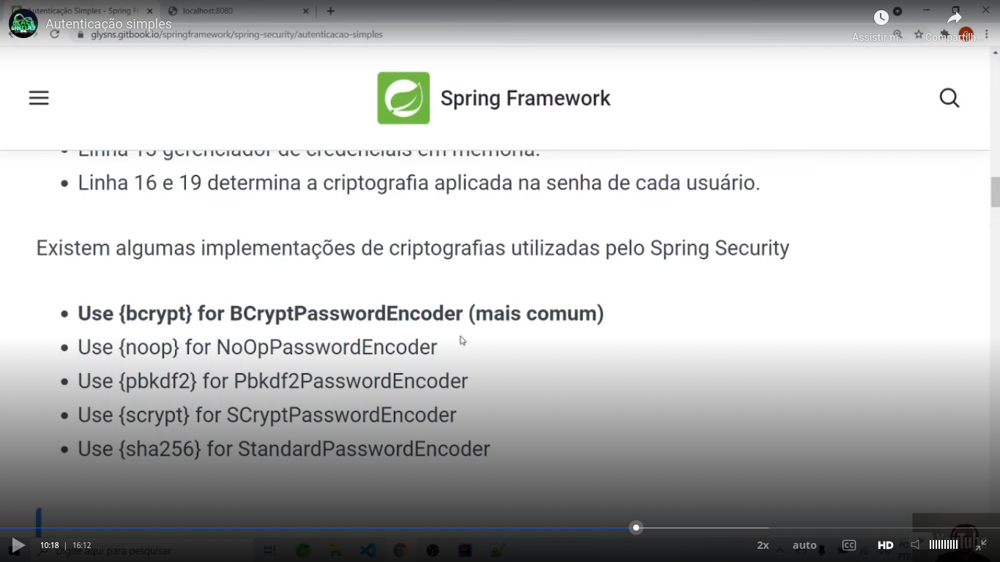
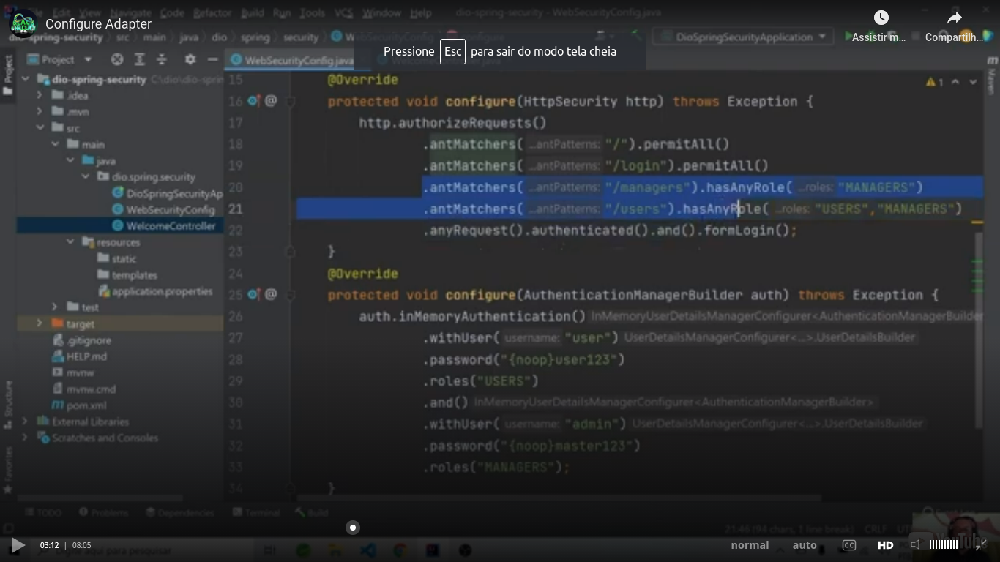
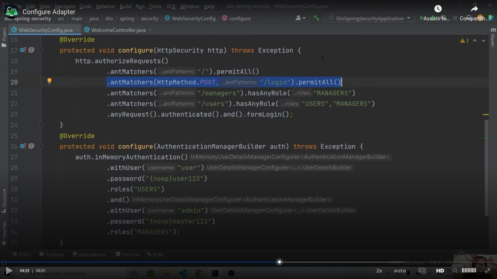

# General

## Initial links

Class [link](https://web.dio.me/course/adicionando-seguranca-a-uma-api-rest-com-spring-security/learning/99032de1-b0da-4986-9907-6028acc4202d?back=/track/coding-the-future-claro-java-spring-boot&tab=undefined&moduleId=undefined)

Github [repository link](https://github.com/digitalinnovationone/dio-springboot)


## Enabling


## Project generated

This is how I generated the project in [[http://start.spring.io](http://start.spring.io)]:



I generated the project of the file `project-generated-with-initializr.zip` and unpacked the files in the root directory.

I also has to create the file `application.properties` in the root directory with this content:

```
server.port=8081
```

After, I ran the commands:

```
mvn install
mvn spring-boot:run
```

In the root link I saw this page after Spring Boot was receiving requests:



To use the default user (who is `"user"`), please locate the password in the console:



To created a hardcoded (not recommended, only to simplify) user and password, please insert this configuration in the `application.properties` file:

```
spring.security.user.name=user
spring.security.user.password=password
spring.security.user.roles=USERS
```


## Simple authentication in memory

Teacher enabled a simple authentication in memory this way. This involves deprecated things nowdays, so I only made [this video](https://youtu.be/3Vg_elM7KXw) about this thing. 


## Cryptography options




## Controlling access by roles

I generated this controller:

```
package dio.spring.security.controllers;

import org.springframework.security.access.prepost.PreAuthorize;
import org.springframework.security.config.annotation.method.configuration.EnableGlobalMethodSecurity;
import org.springframework.web.bind.annotation.GetMapping;
import org.springframework.web.bind.annotation.RestController;

@RestController
@EnableGlobalMethodSecurity(prePostEnabled = true)
public class WelcomeController {
    @GetMapping
    @PreAuthorize("hasAnyRole('managers', 'users')")
    public String welcome(){
        return "Welcome to My Spring Boot Web API";
    }

    @PreAuthorize("hasAnyRole('users')")
    @GetMapping("/users")
    public String users() {
        return "Authorized user";
    }

    @PreAuthorize("hasAnyRole('managers')")
    @GetMapping("/managers")
    public String managers() {
        return "Authorized manager";
    }
}
```

And I have this `application.properties`:

```
server.port=8081
spring.security.user.name=user
spring.security.user.password=password
spring.security.user.roles=users
```

I only eddited this two files until now. Until now, with the user "user":

- I can access the routes:
  - /
  - /users
- I get an HTTP error status 403 when I access:
  - /managers

I made [this video](https://youtu.be/H-jyFpcq9LQ) about this question.


## WebSecurityConfigurerAdapter

Teacher teached about `WebSecurityConfigurerAdapter` but now (is not the guilty of the teacher) is deprecated as you can see [in this link](https://cursos.alura.com.br/forum/topico-websecurityconfigureradapter-deprecated-222772). I can't import a class that is used in inheritance to complete the testing process. In this link you can see what to do as alternative, but I did not test this suggestion.

In summary, teacher transfered the access control based in roles after the user is authenticated from the controller for a specific config class. In particular, to me is better to mantain this configuration in the controller. Is a simple annotation and you wiil not need to open another file. You will need to **this part** of configuration only accessing the controller file.

To be more clear, please see the file eddited by teacher. He eddited only the first method:



Teacher teached us that you can specify the HTTP method allowed:

