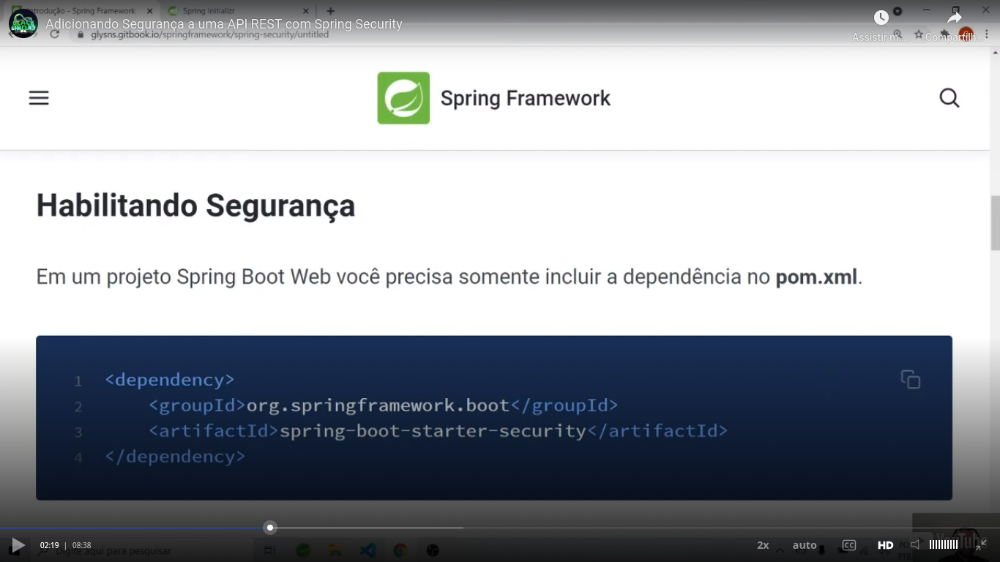

# General

## Initial links

Class [link](https://web.dio.me/course/adicionando-seguranca-a-uma-api-rest-com-spring-security/learning/99032de1-b0da-4986-9907-6028acc4202d?back=/track/coding-the-future-claro-java-spring-boot&tab=undefined&moduleId=undefined)

Github [repository link](https://github.com/digitalinnovationone/dio-springboot)

# Enabling

